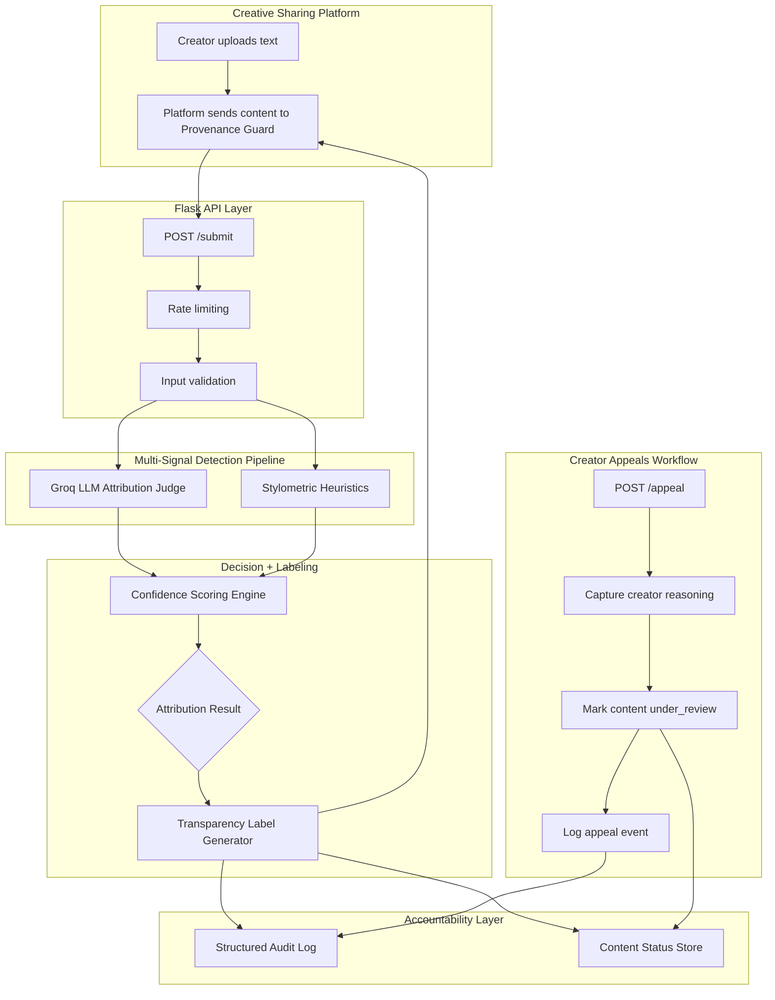

# planning.md

# Provenance Guard — Planning Document

## Purpose

Provenance Guard is a backend attribution-analysis service for creative sharing platforms. A platform can submit text-based creative work, such as a poem, short story excerpt, essay, or blog post, and Provenance Guard returns an attribution result, confidence score, and reader-facing transparency label.

The goal is not to punish AI use or police creativity. The goal is to give readers clearer context, protect creator attribution, and provide a fair appeals process when creators believe a classification is wrong.

---

## Architecture



---

## Submission Flow Narrative

When a platform submits a piece of text to Provenance Guard, the request first passes through input validation and rate limiting. Validation checks that the content exists, is text-based, and is long enough to analyze meaningfully. Rate limiting prevents one client from overwhelming the service or abusing the analysis endpoint.

After validation, the content is passed to the multi-signal detection pipeline. The first signal is a Groq LLM-based attribution judge. This signal evaluates the text semantically and stylistically and returns an AI-likelihood estimate with a brief reason. The second signal is a pure-Python stylometric heuristic system. This signal measures statistical properties of the writing, such as sentence length variation, vocabulary diversity, punctuation patterns, and repetition.

The confidence scoring engine combines both signals into a final attribution result. The system does not force every submission into a binary label. Instead, it returns one of three outcomes: high-confidence AI, high-confidence human, or uncertain. The confidence score determines which label is shown. A 0.95 confidence result should produce a much stronger label than a 0.51 result.

After scoring, the transparency label generator creates plain-language text that a creative platform could display to readers. The API response includes the attribution result, confidence score, final AI-likelihood score, signal details, transparency label, submission ID, and content status.

Every decision is written to a structured audit log. The log includes the content ID, timestamp, attribution result, confidence score, signals used, signal outputs, label text, and status. This makes the system accountable and reviewable after deployment.

If a creator contests a classification, the platform can send an appeal request. Provenance Guard records the creator’s reasoning, links the appeal to the original decision, updates the content status to `under_review`, and appends the appeal to the audit log. Automated reclassification is not required for this version.

---

## Core Components

### Flask API

The Flask API exposes the endpoints that external platforms use.

Required endpoints:

* `POST /submit`
* `POST /appeal`
* `GET /log`

Optional helper endpoint:

* `GET /health`

The API is intentionally backend-first. A UI could be added later, but the core product is a service that other creative platforms can plug into.

---

### Input Validator

The input validator checks that submitted content is usable before sending it through the classifier.

Validation rules:

* Content must be present.
* Content must be a string.
* Content must not be empty or whitespace-only.
* Content should meet a minimum length threshold.
* Extremely long content may be rejected or truncated depending on implementation.

The validator protects the rest of the pipeline from malformed requests and makes API behavior predictable.

---

### Rate Limiter

The submission endpoint is rate limited to reduce abuse and control API cost.

Chosen limits:

```text
POST /submit: 10 requests per minute per client IP
POST /appeal: 5 requests per minute per client IP
GET /log: 30 requests per minute per client IP
```

Reasoning:

The analysis endpoint is the most expensive because it may call an external LLM. Ten requests per minute is enough for development and demo use while preventing accidental loops or spam. Appeals are lower volume by nature, so five per minute is reasonable. Log viewing is cheaper, so it can allow a higher limit.

---

## Multi-Signal Detection Pipeline

Provenance Guard uses one LLM-based signal and one non-LLM stylometric signal.

---

### Signal 1: Groq LLM Attribution Judge

This signal uses Groq with `llama-3.3-70b-versatile` as an LLM-as-judge classifier.

What it measures:

The LLM evaluates whether the submitted creative text appears more consistent with AI-generated writing, human-authored writing, or an uncertain mix. It can notice high-level patterns such as generic phrasing, overly even structure, lack of concrete lived detail, repetitive transitions, or unusually polished but shallow language.

Why this signal was chosen:

An LLM can evaluate meaning, tone, coherence, and stylistic patterns that are difficult to capture with simple formulas. Since the content is creative writing, semantic judgment is useful.

Blind spots:

The LLM can be overconfident. It may mistake polished human writing for AI writing, or messy AI writing for human writing. It may also be biased by genre, topic, writing skill, or whether the text resembles examples it has seen before. For that reason, this signal should not be used alone.

Expected output:

```json
{
  "ai_likelihood": 0.0,
  "human_likelihood": 0.0,
  "reason": "One sentence explaining the signal."
}
```

---

### Signal 2: Stylometric Heuristics

This signal uses pure Python calculations to measure statistical properties of the text.

What it measures:

* Average sentence length
* Sentence length variance
* Vocabulary diversity
* Repetition rate
* Punctuation variety
* Paragraph length consistency

Why this signal was chosen:

AI-generated text often has smoother sentence structure, more even paragraphing, and more repetitive phrasing than human writing. Human writing often has more uneven rhythm, more idiosyncratic word choice, and more variation in sentence length. These are not perfect indicators, but they provide a useful independent signal.

Blind spots:

Stylometric heuristics cannot understand meaning or intent. A human can intentionally write in a polished, even style. An AI can be prompted to write with more variation and imperfection. Short submissions may not contain enough text for reliable statistics.

Expected output:

```json
{
  "ai_likelihood": 0.0,
  "human_likelihood": 0.0,
  "features": {
    "avg_sentence_length": 0.0,
    "sentence_length_variance": 0.0,
    "vocabulary_diversity": 0.0,
    "repetition_rate": 0.0,
    "punctuation_variety": 0.0
  },
  "reason": "One sentence explaining the signal."
}
```

---

## Confidence Scoring Approach

The confidence scoring engine combines the two signal outputs into one final score.

Planned approach:

```text
final_ai_score = (0.65 * llm_ai_likelihood) + (0.35 * stylometric_ai_likelihood)
```

The LLM signal receives more weight because it can evaluate semantic and stylistic context. The stylometric signal still matters because it is independent, cheaper, and deterministic.

Classification thresholds:

```text
final_ai_score >= 0.75:
    high_confidence_ai

final_ai_score <= 0.25:
    high_confidence_human

0.26 <= final_ai_score <= 0.74:
    uncertain
```

Confidence score:

For high-confidence AI:

```text
confidence = final_ai_score
```

For high-confidence human:

```text
confidence = 1 - final_ai_score
```

For uncertain:

```text
confidence = max(final_ai_score, 1 - final_ai_score)
```

This makes uncertainty meaningful. A score near 0.50 should produce an uncertain label with low confidence, while a score near 0.95 should produce a strong high-confidence label. A score like 0.74 still remains uncertain because it does not cross the high-confidence threshold, but it shows a stronger lean than 0.51.

---

## Transparency Label Design

The transparency label should be plain-language, fair, and understandable to non-technical readers.

The system should not say “proven AI” or “proven human,” because the classification is probabilistic. The label should communicate confidence without pretending to be absolute truth.

Three label variants are required:

| Result                | Exact label text                                                                                                                                                                   |
| --------------------- | ---------------------------------------------------------------------------------------------------------------------------------------------------------------------------------- |
| High-confidence AI    | "Provenance Guard found strong signals that this text was likely generated or heavily shaped by AI. This label is based on automated analysis and may be appealed by the creator." |
| High-confidence human | "Provenance Guard found strong signals that this text was likely written primarily by a person. This label is based on automated analysis and is not a guarantee of authorship."   |
| Uncertain             | "Provenance Guard could not determine a confident attribution for this text. The available signals were mixed, so readers should treat the authorship as uncertain."               |

---

## Appeal Workflow

Creators can contest a classification through the appeal workflow.

Appeal requirements:

* Capture the creator’s reasoning.
* Link the appeal to the original content ID.
* Log the appeal alongside the original decision.
* Update the content status to `under_review`.

Appeal request format:

```json
{
  "content_id": "content_123",
  "creator_id": "creator_456",
  "reason": "I wrote this myself and can provide drafts showing my process."
}
```

Appeal response format:

```json
{
  "appeal_id": "appeal_789",
  "content_id": "content_123",
  "status": "under_review",
  "message": "Appeal received. This content is now marked as under review."
}
```

Appeals do not automatically change the attribution result. They mark the decision for human review.

---

## Audit Logging

Every attribution decision and appeal should be written to a structured audit log.

Log format:

```text
logs/audit_log.jsonl
```

Each line is one JSON object.

Decision log fields:

```json
{
  "event_type": "decision",
  "timestamp": "2026-06-29T12:00:00Z",
  "content_id": "content_123",
  "client_id": "127.0.0.1",
  "result": "high_confidence_ai",
  "confidence": 0.91,
  "final_ai_score": 0.91,
  "label_text": "Provenance Guard found strong signals that this text was likely generated or heavily shaped by AI. This label is based on automated analysis and may be appealed by the creator.",
  "signals": {
    "llm": {
      "ai_likelihood": 0.94,
      "reason": "The text has polished but generic phrasing and highly even structure."
    },
    "stylometric": {
      "ai_likelihood": 0.85,
      "features": {
        "avg_sentence_length": 18.4,
        "sentence_length_variance": 2.1,
        "vocabulary_diversity": 0.42,
        "repetition_rate": 0.18,
        "punctuation_variety": 0.12
      }
    }
  },
  "status": "active"
}
```

Appeal log fields:

```json
{
  "event_type": "appeal",
  "timestamp": "2026-06-29T12:05:00Z",
  "appeal_id": "appeal_789",
  "content_id": "content_123",
  "creator_id": "creator_456",
  "reason": "I wrote this myself and can provide drafts showing my process.",
  "previous_result": "high_confidence_ai",
  "new_status": "under_review"
}
```

---

## Testing Plan

### Analyze endpoint tests

Test cases:

1. Clearly AI-like sample
2. Clearly human-like sample
3. Mixed or ambiguous sample
4. Empty content
5. Very short content
6. Repeated rapid requests to trigger rate limiting

Expected behavior:

* Valid content returns attribution result, confidence score, label text, and signal details.
* Empty content returns a validation error.
* Ambiguous content returns `uncertain`.
* Rapid repeated requests eventually return a rate-limit error.

---

### Confidence scoring tests

The confidence score should behave differently at different levels.

Examples:

```text
final_ai_score = 0.95 → high_confidence_ai
final_ai_score = 0.77 → high_confidence_ai
final_ai_score = 0.51 → uncertain
final_ai_score = 0.24 → high_confidence_human
final_ai_score = 0.05 → high_confidence_human
```

The system should not treat 0.51 and 0.95 as the same. A borderline score should produce the uncertain label.

---

### Appeal tests

Test cases:

1. Submit valid appeal for an existing content ID.
2. Submit appeal for a missing content ID.
3. Submit appeal with empty reasoning.
4. Confirm that valid appeal updates status to `under_review`.
5. Confirm that appeal is written to the audit log.

---

## AI Tool Plan

This planning document will be used as the reference spec when generating implementation code with AI tools. Each implementation milestone will use only the relevant sections of this document so the generated code stays aligned with the architecture.

### M3 — Submission Endpoint + First Signal

Spec sections to provide to the AI tool:

* Architecture
* Submission Flow Narrative
* Core Components
* Signal 1: Groq LLM Attribution Judge
* Audit Logging

Request to AI tool:

Generate a Flask app skeleton with a `POST /submit` endpoint. The endpoint should validate incoming text content, call the first detection signal function, return a structured JSON response, and write a decision event to the audit log. Also generate the first signal function for the Groq LLM attribution judge.

Verification plan:

Before wiring everything together, test the Groq signal function directly with a few inputs: one clearly AI-like passage, one more human-like creative passage, and one very short or ambiguous passage. Confirm that the signal returns an `ai_likelihood`, `human_likelihood`, and `reason` in the expected format.

### M4 — Second Signal + Confidence Scoring

Spec sections to provide to the AI tool:

* Architecture
* Multi-Signal Detection Pipeline
* Signal 2: Stylometric Heuristics
* Confidence Scoring Approach
* Testing Plan

Request to AI tool:

Generate the stylometric heuristic signal and the confidence scoring logic. The stylometric signal should calculate features such as average sentence length, sentence length variance, vocabulary diversity, repetition rate, and punctuation variety. The scoring logic should combine the LLM signal and stylometric signal using the planned weighted formula.

Verification plan:

Test the scoring logic directly with known input values. Confirm that scores around `0.95` and `0.77` produce `high_confidence_ai`, scores around `0.51` produce `uncertain`, and scores around `0.24` or `0.05` produce `high_confidence_human`. Also test whether clearly AI-like and clearly human-like samples produce meaningfully different scores.

### M5 — Production Layer

Spec sections to provide to the AI tool:

* Architecture
* Transparency Label Design
* Appeal Workflow
* Audit Logging
* Rate Limiter
* Testing Plan

Request to AI tool:

Generate label generation logic, rate limiting, the `POST /appeal` endpoint, and the `GET /log` endpoint. The appeal endpoint should capture creator reasoning, link the appeal to the original submission, update the content status to `under_review`, and write an appeal event to the audit log.

Verification plan:

Test that all three label variants are reachable by passing scores that produce high-confidence AI, high-confidence human, and uncertain results. Submit an appeal for an existing submission and confirm that the content status changes to `under_review`. Confirm that both the original decision and the appeal appear in the structured audit log.

---

## Implementation Notes

To be completed after implementation:

* Final endpoints implemented:
* Final rate limits used:
* Final signal weights used:
* Example `/submit` response:
* Example `/appeal` response:
* Three audit log entries:
* One surprising classification:
* One change made after testing:
